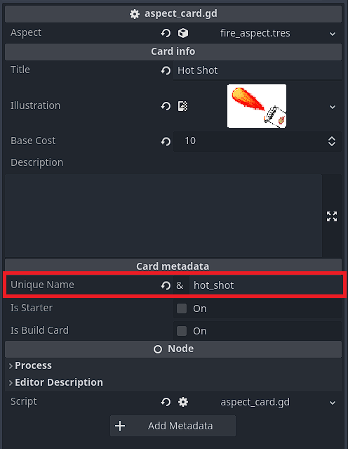

By pressing F3, you can display the debug console, allowing you to setup the game in a state for your purposes without having to get it manually. This can be extremely useful for a variety of reasons.

Commands have a keyword which is the first word you type, each command can have arguments as well, which are the words following the keywords.

Arguments for commands will be documented as follows:

``` 
keyword !required_argument ?optional_argument
```

Do not put the exclamation marks or question marks when writing commands, they are just here to show what is required and what is optional

## Set commands

Set commands simply set a value like health or power. Here is a list of them.
### Set power

```
power !value
```

### Set HP

```
hp !value
```

Note that you can still not go beyond max HP and if you set it to zero or below, the player will die.

## Skip command

The skip command allows you to travel through the game without having to wait or play the game. This can be used to skip rounds for example.

```
skip ?how_much
```

If the command is used without arguments, it will skip a round, if the argument is "battle", it will end the battle as if you won it.

## Card command

This command (very useful) allows you to add a card to your hand by typing its unique name as the first argument.

```
card !unique_name
```

The unique name of a card can be found by looking at the card object in the inspector, either by selecting the packed scene in the files or by going to the card registry scene and finding the card you want.



To add this card to your hand you would thus type:

```
card hot_shot
```